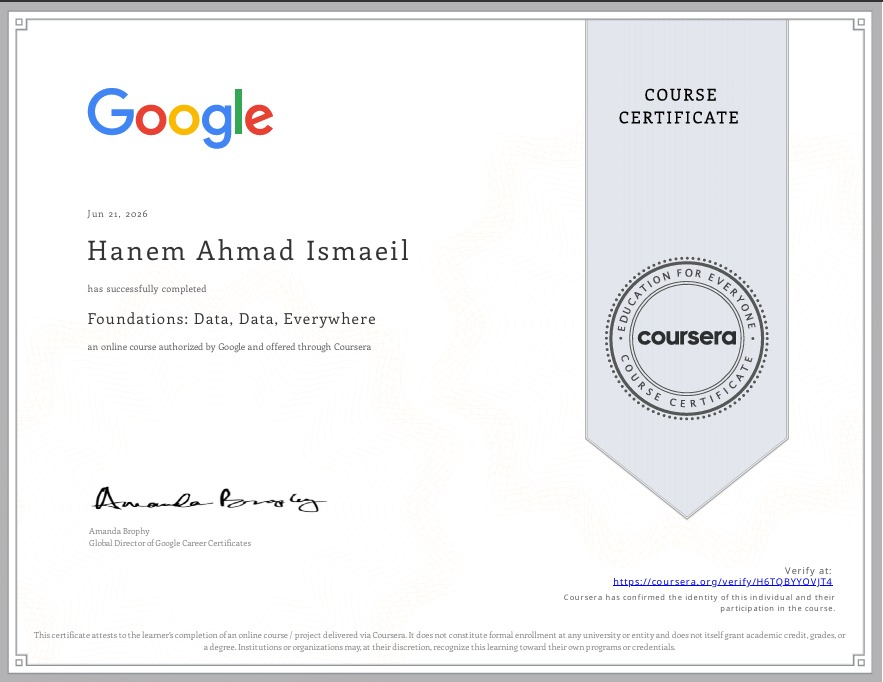
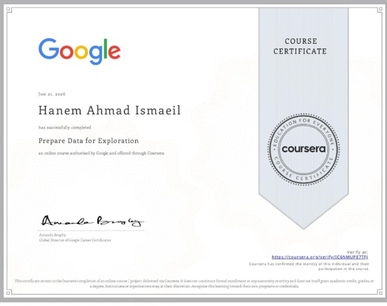
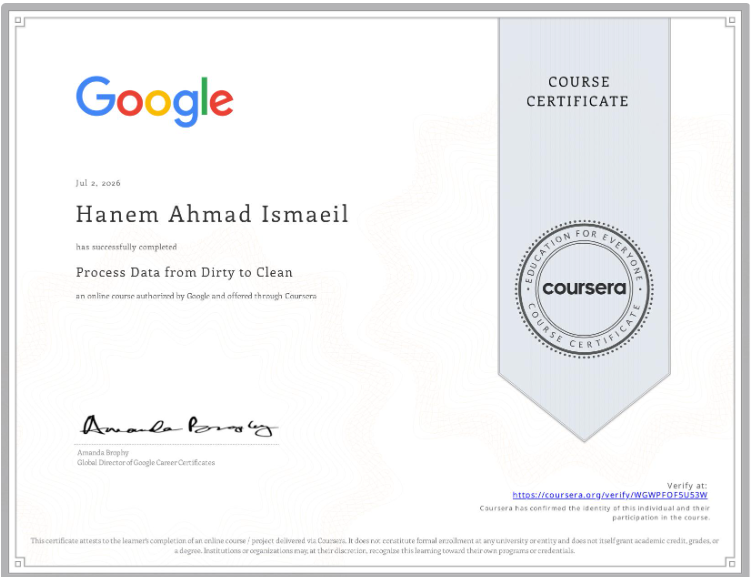
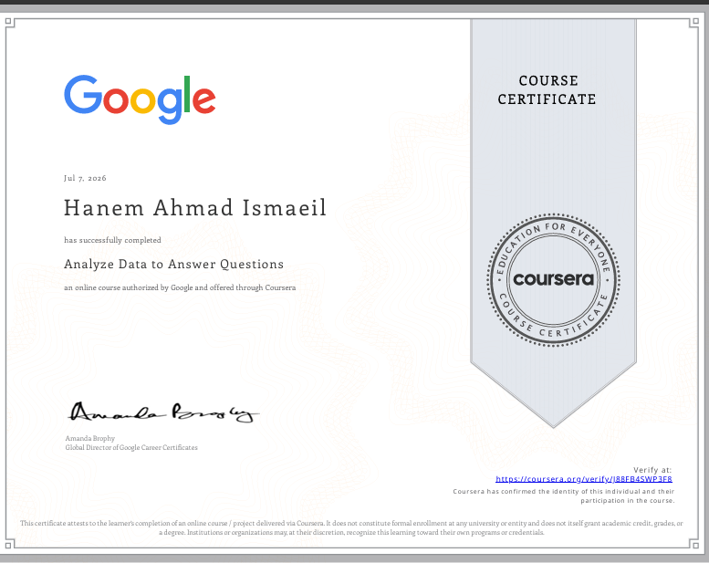
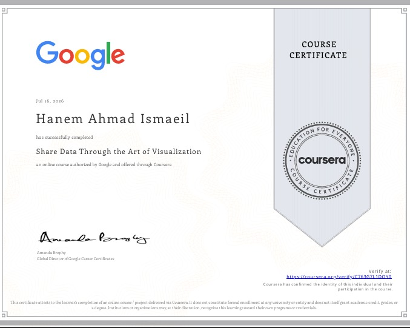
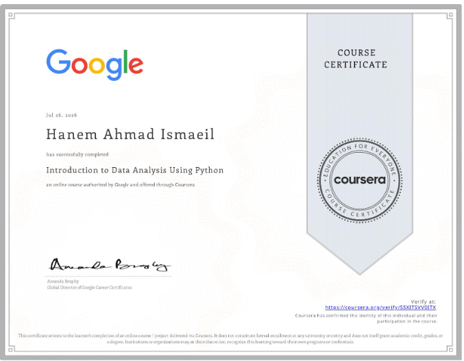
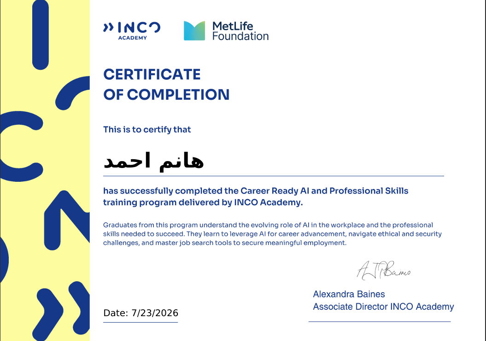

# 📜 Certifications

## Google Data Analytics Professional Certificate (Coursera)

### Course 1: Foundations: Data, Data, Everywhere

---

### Course 2: Ask Questions to Make Data-Driven Decisions

---

### Course 3: Prepare Data for Exploration

---

### Course 4: Process Data from Dirty to Clean

---

### Course 5: Analyze Data to Answer Questions

---

### Course 6: Share Data Through the Art of Visualization

---

### Course 7: Introduction to Data Analysis Using Python

---

## Career Ready AI and Professional Skills

